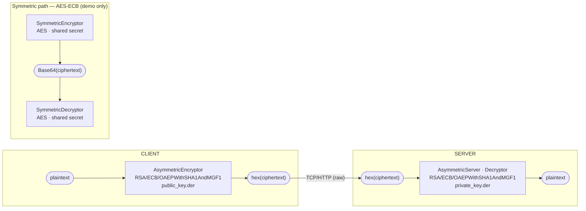

# encrypt-decrypt — Asymmetric & Symmetric Cryptography in Scala

A reference implementation demonstrating **RSA asymmetric encryption** (client encrypts with
public key → server decrypts with private key) and **AES symmetric encryption**, written in
Scala 3 with the Java Cryptography Architecture (JCA/JCE).

> **Scope** — This repo is an educational reference. See [docs/threat-model.md](docs/threat-model.md)
> for a full list of known gaps before adapting any code for production.

---

## Table of Contents

1. [Architecture](#architecture)
2. [Cryptographic Design](#cryptographic-design)
3. [Build & Run](#build--run)
4. [API Usage](#api-usage)
5. [Key Management](#key-management)
6. [Testing](#testing)
7. [Deep-Dive Documentation](#deep-dive-documentation)
8. [Related Projects](#related-projects)

---

## Architecture



Both paths share a common trait:

```scala
// client/Encryptor.scala
trait Encryptor { def enc(data: String): Option[String] }

// server/Decryptor.scala
trait Decryptor  { def decrypt(hexData: String): Either[Throwable, String] }
```

---

## Cryptographic Design

### Asymmetric path — RSA-OAEP

| Parameter     | Value |
|---------------|-------|
| Algorithm     | RSA |
| Padding       | OAEP (IND-CCA2 secure) |
| Hash (OAEP)   | SHA-1 |
| MGF           | MGF1 with SHA-1 |
| Key format    | DER — `X509EncodedKeySpec` (public), `PKCS8EncodedKeySpec` (private) |
| Key size      | 1024-bit *(demo only — use >= 2048-bit in production)* |
| Max plaintext | 86 bytes (1024-bit OAEP-SHA1: `128 - 2x20 - 2`) |
| Wire encoding | Hex string (`BigInteger.toString(16)`) |

**Why OAEP over PKCS#1 v1.5?** OAEP is randomised and provides IND-CCA2 security.
PKCS#1 v1.5 is vulnerable to Bleichenbacher's 1998 padding oracle attack.
See [docs/asymmetric-rsa.md](docs/asymmetric-rsa.md) for the full construction.

### Symmetric path — AES

| Parameter     | Value |
|---------------|-------|
| Algorithm     | AES |
| Mode          | ECB *(demo only — use GCM in production)* |
| Key size      | 128-bit (16 bytes, padded from passphrase) |
| Wire encoding | Base64 |

**Why ECB is problematic:** identical plaintext blocks produce identical ciphertext blocks —
structure leaks. Use `AES/GCM/NoPadding` with a random 96-bit nonce in production.
See [docs/symmetric-aes.md](docs/symmetric-aes.md).

---

## Build & Run

**Requirements:** JDK 11+, sbt 1.x

```bash
# compile
sbt compile

# run server (listens on :9999)
sbt run

# run tests
sbt test

# clean
sbt clean
```

---

## API Usage

The server exposes a raw HTTP endpoint on port `9999`.
Send an RSA-OAEP encrypted hex payload via `POST`:

```bash
curl -XPOST 10.0.0.179:9999 \
  -H "Accept: application/json" \
  -d "5aae8b0e3db810c13876838452b18cbede9890c665f2fd2ffe2dcccd7ba414687c1a9b531ca359e26c6f4433c54644c7bdbff159e55a5544905fed7598397476fdc4164c424c1505fd7cf5b2d0fc22b6981b2e12b4daf2c55180e4324c3917a1bbbe2d03ac55b801d5f6dcdc4e57ed9404b85082574530dbb80288de837757d0f51d49d74bd31297c75d18f03c43a403f7ffd21e69c556afa6747b02df8bbff6389b5e31ff5eff3eb2d402f8b97eb310391c73212ddb51fa6b1b130a51583d8a33151cf66fd3abc18ed22f5e78b2962cb99b881ee5f63e09096c10d96f95a830cf7f8e96b2efb54f7d7b7955786b3edb0f0678c09a86b67b1ded612ad4ad5be3"
```

Response:

```json
{
  "decrypted": "data to encrypt",
  "encrypted": "<original hex>"
}
```

### Generate a test ciphertext from the Scala client

```scala
new AsymmetricEncryptor("src/main/resources/keypair_DER/public_key.der")
  .enc("hello world")
  .foreach(println)
```

---

## Key Management

### Generate DER keys (recommended — 2048-bit)

```bash
openssl genrsa -out private_key.pem 2048
openssl rsa    -in private_key.pem -pubout -outform DER -out public_key.der
openssl pkcs8  -topk8 -nocrypt -in private_key.pem -outform DER -out private_key.der
```

### Generate PEM keys (helper scripts included)

```bash
cd src/main/resources/keypair_PEM
./create-pub-private-pair.sh   # wraps openssl genrsa + rsa

./encrypt.sh   # openssl rsautl -encrypt with public key
./decrypt.sh   # openssl rsautl -decrypt with private key
```

> **Never commit private keys.** Add `**/*.der` and `**/*.pem` to `.gitignore`.
> See [docs/threat-model.md](docs/threat-model.md#key-management).

---

## Testing

```bash
sbt test
```

| Test class | What it covers |
|------------|----------------|
| `AsymmetricEncryptorSpecs` | Round-trip encrypt with DER public key; prints hex output |
| `SymmetricEncryptorSpecs`  | AES-ECB encrypt of an 800-byte Base64 JWT-like payload |

---

## Deep-Dive Documentation

| Document | Contents |
|----------|----------|
| [docs/asymmetric-rsa.md](docs/asymmetric-rsa.md) | RSA math, OAEP construction, key size security table, DER/PEM formats, max plaintext size |
| [docs/symmetric-aes.md](docs/symmetric-aes.md) | AES SPN internals, ECB vs GCM, PBKDF2 key derivation, hybrid encryption pattern |
| [docs/threat-model.md](docs/threat-model.md) | STRIDE threat model, known vulnerabilities, production hardening checklist |

---

## Related Projects

- [prayagupa/tls.kotlin](https://github.com/prayagupa/tls.kotlin) — TLS in Kotlin
- [prayagupa/tls-python](https://github.com/prayagupa/tls-python) — TLS in Python

### External references

- [OAEP — Wikipedia](https://en.wikipedia.org/wiki/Optimal_asymmetric_encryption_padding)
- [Padding (cryptography) — Wikipedia](https://en.wikipedia.org/wiki/Padding_(cryptography))
- [PKCS#1 RFC 8017](https://datatracker.ietf.org/doc/html/rfc8017)
- [SO: decrypt string with public key for hash comparison](https://stackoverflow.com/a/19002068/432903)
- [SO: RSA/ECB/PKCS1 encode with public key](https://stackoverflow.com/a/37397545/432903)
